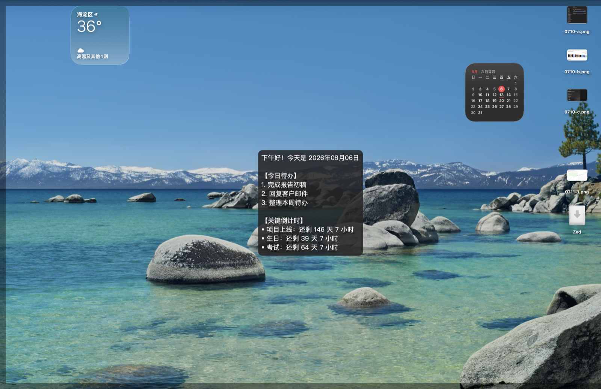

# mac-unlock-briefing

[English](README.md) · **中文**

macOS 解锁屏幕后，自动弹出今日待办和关键日期倒计时（基于 [Hammerspoon](https://www.hammerspoon.org/)）。

原生 Swift 版（不再依赖 Hammerspoon）：[unlock-briefing](https://github.com/uraraneko/unlock-briefing)。

## 安装

```bash
git clone https://github.com/uraraneko/mac-unlock-briefing.git
cd mac-unlock-briefing
./setup.sh
```

1. 授予 **辅助功能** 权限：系统设置 → 隐私与安全性 → 辅助功能 → 启用 Hammerspoon  
2. 菜单栏锤子图标 → **Reload Config**  
3. 锁屏再解锁，即可看到简报  

可选：锤子菜单开启 **Launch Hammerspoon at login**。

## 多设备同步（私有仓库）

待办内容默认存放在本地私有数据仓库（或本地 `content.json`），不会被推送到本公开仓库：
1. 默认数据路径优先读取 `~/.hammerspoon/data/content.json`。
2. 每次按下 **⌘⇧U** 时，Hammerspoon 会在后台自动执行双向同步（`git pull --rebase` & `git push`），确保多台 Mac 上的待办与倒计时实时一致。
3. 若同步时拉取到新数据，弹窗内容将自动刷新为最新内容。

## 配置

编辑 **`content.json`**（或 `data/content.json`）：

```json
{
  "todos": ["完成报告初稿", "回复客户邮件"],
  "countdowns": [
    { "title": "项目上线", "date": "2026-12-31" }
  ]
}
```



显示时长、样式、热键等改 **`config.lua`**。

改完后 **Reload Config**。开发调试可按 **⌘⇧U** 切换简报（打开 / 立刻关闭）。
